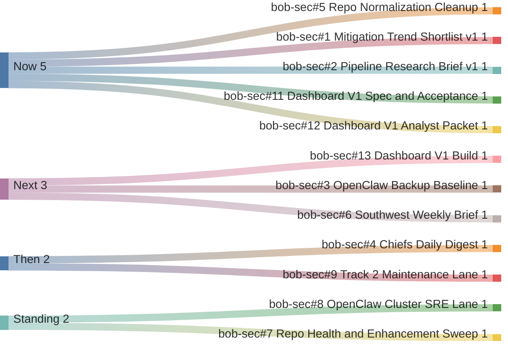

# Current Work Gantt

Manager view as of 2026-04-13 MST.

## Bucket Meaning
- **Now**: 0 to 1h
- **Next**: 1 to 6h
- **Then**: 6 to 24h
- **Standing**: recurring or ongoing lanes

## Critical Path
1. `bob-sec#5`
2. `bob-sec#1`
3. `bob-sec#2`
4. `bob-sec#11` and `bob-sec#12`
5. `bob-sec#13`
6. `bob-sec#3`

## Queue Summary
- **Now**: `#5`, `#1`, `#2`, `#11`, `#12`
- **Next**: `#13`, `#3`, `#6`
- **Then / Standing**: `#4`, `#7`, `#8`, `#9`
