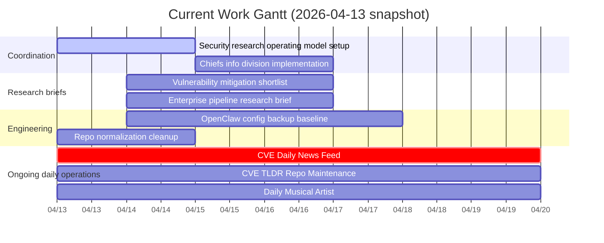

# Current Work Gantt

Manager view as of 2026-04-13.

## Notes
- `bob-sec#1` supports the vulnerability mitigation research track.
- `bob-sec#2` supports the enterprise security pipeline design track.
- `bob-sec#3` supports the OpenClaw config backup track.
- `bob-sec#4` supports the Chiefs daily digest workflow.
- Daily automations are already live; the chart treats them as ongoing operational lanes over the next week.
- Dates beyond approved deadlines are manager planning estimates and should be refined as Analyst and Engineer close the next cycle of work.
