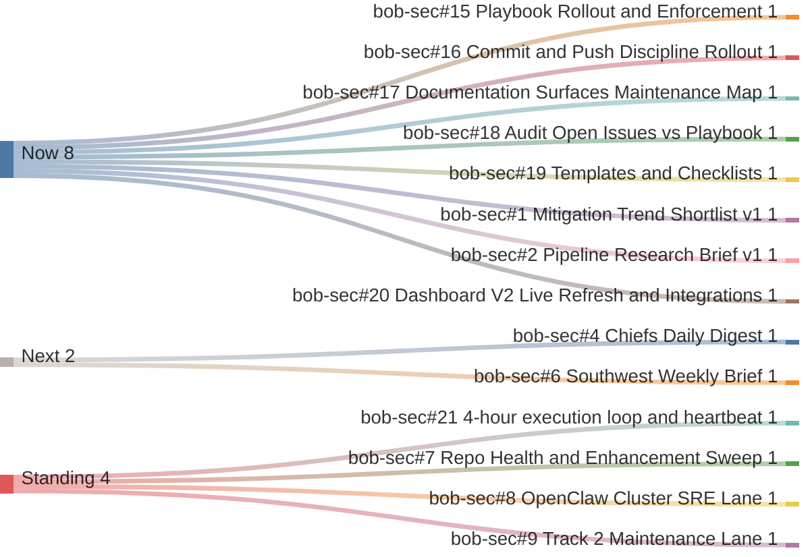

# Current Work Gantt

Manager view as of 2026-04-13 MST.

## Bucket Meaning
- **Now**: 0 to 1h
- **Next**: 1 to 6h
- **Then**: 6 to 24h
- **Standing**: recurring or ongoing lanes

## Critical Path
1. `bob-sec#15` through `#19`
2. `bob-sec#1`
3. `bob-sec#2`
4. `bob-sec#20`
5. `bob-sec#4`
6. `bob-sec#6`
7. `bob-sec#21`
8. `bob-sec#7` through `#9`

## Queue Summary
- **Now**: `#15`, `#16`, `#17`, `#18`, `#19`, `#1`, `#2`, `#20`
- **Next**: `#4`, `#6`
- **Standing**: `#21`, `#7`, `#8`, `#9`
