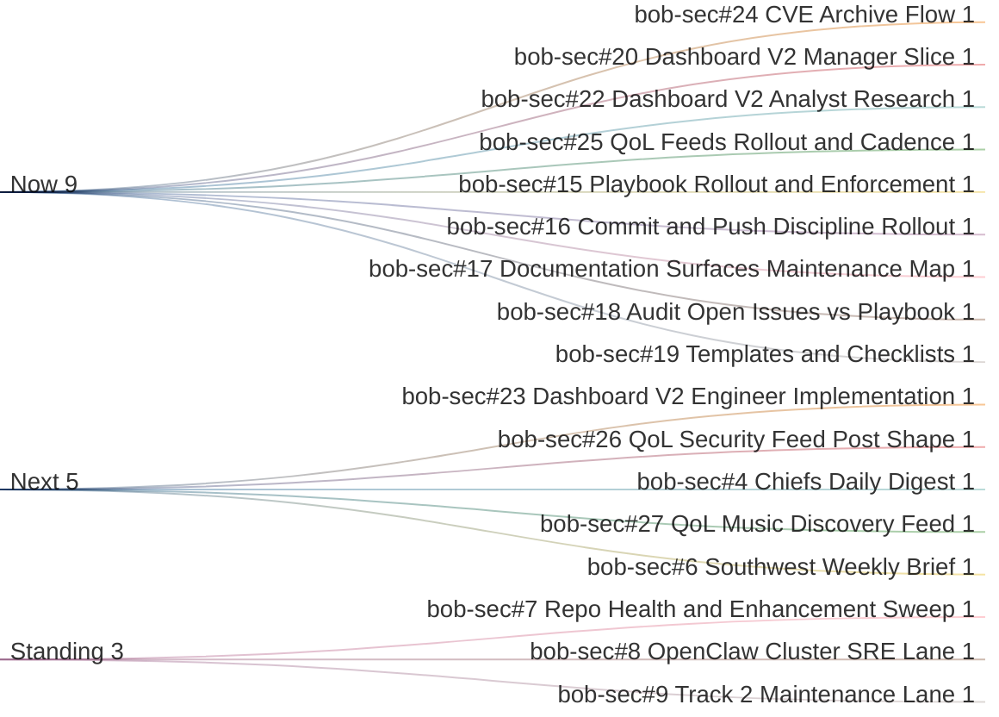

# Current Work Gantt

Manager view as of 2026-04-13 MST.

## Bucket Meaning
- **Now**: 0 to 1h
- **Next**: 1 to 6h
- **Then**: 6 to 24h
- **Standing**: recurring or ongoing lanes

## Critical Path
1. `bob-sec#24`
2. `bob-sec#20`
3. `bob-sec#25`
4. `bob-sec#15` through `#19`
5. `bob-sec#22`
6. `bob-sec#23`
7. `bob-sec#26`
8. `bob-sec#27`
9. `bob-sec#4`
10. `bob-sec#6`
11. `bob-sec#7` through `#9`

## Queue Summary
- **Now**: `#24`, `#20`, `#22`, `#25`, `#15`, `#16`, `#17`, `#18`, `#19`
- **Next**: `#23`, `#26`, `#4`, `#27`, `#6`
- **Standing**: `#7`, `#8`, `#9`
